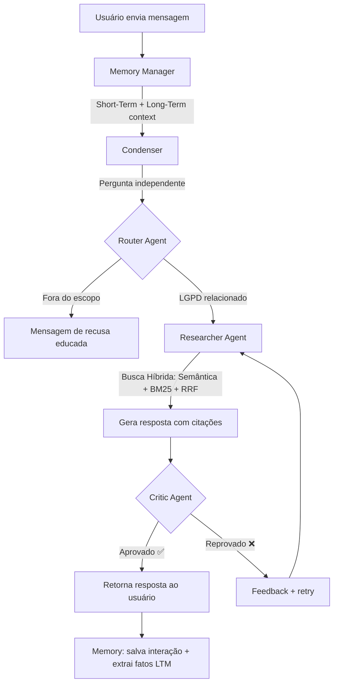

<div align="center">

# 🛡️ Chat LGPD — Assistente Inteligente sobre a Lei Geral de Proteção de Dados

**Chatbot com arquitetura multi-agente RAG (Retrieval-Augmented Generation) especializado na Lei 13.709/2018 (LGPD)**

[](https://python.org)
[](https://fastapi.tiangolo.com)
[](https://react.dev)
[](https://vitejs.dev)
[](https://groq.com)
[](LICENSE)

</div>

---

## 📋 Índice

- [Visão Geral](#-visão-geral)
- [Arquitetura](#-arquitetura)
- [Estrutura do Projeto](#-estrutura-do-projeto)
- [Pipeline Multi-Agente](#-pipeline-multi-agente)
- [Tecnologias](#-tecnologias)
- [Pré-requisitos](#-pré-requisitos)
- [Instalação](#-instalação)
- [Uso](#-uso)
- [Decisões Técnicas](#-decisões-técnicas)
- [Licença](#-licença)

---

## 🎯 Visão Geral

O **Chat LGPD** é um assistente virtual que responde perguntas exclusivamente sobre a **Lei Geral de Proteção de Dados (LGPD — Lei nº 13.709/2018)**. Ele utiliza uma arquitetura **RAG multi-agente** com guardrails de entrada e saída para garantir respostas fiéis à legislação, sem alucinações.

### Principais Características

- 🔍 **Busca Híbrida** — Combina busca semântica (ChromaDB) + lexical (BM25) com fusão via Reciprocal Rank Fusion (RRF)
- 🤖 **4 Agentes Especializados** — Router (guardrail de entrada), Researcher (gerador de respostas), Critic (guardrail de saída) e Memory (contexto conversacional)
- 🧠 **Memória em 3 Camadas** — Short-Term (últimas interações), Medium-Term (resumo de sessão) e Long-Term (perfil do usuário persistido)
- 📚 **Modelo Parent-Child** — Chunks hierárquicos da LGPD preservando contexto completo de cada artigo
- ⚡ **Inferência via Groq** — Baixa latência com interface OpenAI-compatível

---

## 🏗️ Arquitetura

```
┌─────────────────────────────────────────────────────────────────────┐
│                         Frontend (React + Vite)                     │
│                         http://localhost:5173                       │
└──────────────────────────────┬──────────────────────────────────────┘
                               │ POST /api/chat
                               ▼
┌─────────────────────────────────────────────────────────────────────┐
│                      FastAPI (uvicorn :8000)                        │
│                      apps/api_rag/main.py                           │
└──────────────────────────────┬──────────────────────────────────────┘
                               │
                               ▼
┌─────────────────────────────────────────────────────────────────────┐
│                        RAG Orchestrator                             │
│                    apps/api_rag/orchestrator.py                      │
│                                                                     │
│   ┌──────────┐   ┌────────────┐   ┌──────────┐   ┌──────────────┐ │
│   │  Memory   │──▶│ Condenser  │──▶│  Router   │──▶│  Researcher  │ │
│   │ (3 layers)│   │(reformulate)│   │(guardrail)│   │(hybrid RAG) │ │
│   └──────────┘   └────────────┘   └──────────┘   └──────┬───────┘ │
│                                                          │         │
│                                        ┌─────────┐       │         │
│                                        │  Critic  │◀──────┘         │
│                                        │(validate)│                 │
│                                        └─────────┘                 │
└─────────────────────────────────────────────────────────────────────┘
                               │
                    ┌──────────┴──────────┐
                    ▼                     ▼
            ┌──────────────┐     ┌──────────────┐
            │   ChromaDB    │     │   Groq API   │
            │  (vectordb/)  │     │  (LLM calls) │
            └──────────────┘     └──────────────┘
```

---

## 📁 Estrutura do Projeto

```
chat-lgpd/
├── apps/                          # Aplicações executáveis
│   ├── api_rag/                   # Backend — API FastAPI
│   │   ├── main.py                # Entrypoint do servidor (uvicorn)
│   │   ├── orchestrator.py        # Orquestrador do pipeline multi-agente
│   │   └── requirements.txt       # Dependências do backend
│   └── web-client/                # Frontend — React + Vite + TypeScript
│       ├── src/
│       │   ├── App.tsx            # Componente principal do chat
│       │   ├── App.css            # Estilos do chat (glassmorphism)
│       │   ├── index.css          # Estilos globais
│       │   └── main.tsx           # Entrypoint do React
│       ├── package.json
│       └── vite.config.ts
│
├── packages/                      # Pacotes reutilizáveis
│   ├── ai_agents/                 # Agentes de IA
│   │   ├── router.py              # Input Guardrail — filtra queries fora do escopo
│   │   ├── researcher.py          # Busca híbrida + geração de resposta
│   │   ├── critic.py              # Output Guardrail — valida fidelidade
│   │   ├── memory.py              # Gerenciador de memória (3 camadas)
│   │   ├── vector_db.py           # Ingestão e gerenciamento do ChromaDB
│   │   └── requirements.txt
│   ├── lgpd-scraper/              # Coleta e processamento da LGPD
│   │   ├── collect.py             # Download do HTML oficial do Planalto
│   │   ├── chunker.py             # Chunking hierárquico (Parent-Child)
│   │   └── requirements.txt
│   └── shared_contracts/          # Schemas compartilhados (Pydantic)
│       └── schemas.py             # RouterDecision, ResearcherResponse, CriticDecision
│
├── data/                          # Dados (gerados em runtime)
│   ├── raw/                       # HTML bruto da LGPD (gitignored)
│   ├── processed/                 # Chunks processados (JSON)
│   │   └── lgpd_chunks.json       # 1138 chunks Parent-Child da LGPD
│   └── vectordb/                  # ChromaDB persistido (gitignored)
│
├── .env.example                   # Template de variáveis de ambiente
├── .gitignore
└── README.md
```

---

## 🔄 Pipeline Multi-Agente

Cada mensagem do usuário percorre o seguinte fluxo:



### Detalhes dos Agentes

| Agente | Papel | Schema de Saída |
|--------|-------|-----------------|
| **Router** | Input Guardrail — classifica se a query é relacionada à LGPD | `RouterDecision` (is_lgpd_related, confidence, reasoning) |
| **Researcher** | Executa busca híbrida no ChromaDB + BM25, gera resposta fundamentada | `ResearcherResponse` (answer, citations, is_fully_answered) |
| **Critic** | Output Guardrail — valida se a resposta é fiel ao contexto recuperado | `CriticDecision` (is_faithful, reasoning, suggested_correction) |
| **Memory** | Gerencia contexto conversacional em 3 camadas temporais | N/A (gerenciador interno) |

---

## 🛠️ Tecnologias

### Backend
| Tecnologia | Uso |
|-----------|-----|
| **Python 3.11+** | Linguagem principal |
| **FastAPI** | Framework da API REST |
| **Groq API** | Provedor de inferência LLM (OpenAI-compatível) |
| **ChromaDB** | Vector store local com persistência em disco |
| **SentenceTransformers** | Embeddings multilíngues (`paraphrase-multilingual-MiniLM-L12-v2`) |
| **rank-bm25** | Busca lexical para Hybrid Search |
| **LangChain** | ChatMessageHistory (SQLite) para memória de curto prazo |
| **Pydantic v2** | Schemas tipados para contratos entre agentes |

### Frontend
| Tecnologia | Uso |
|-----------|-----|
| **React 19** | UI do chatbot |
| **TypeScript** | Tipagem estática |
| **Vite 8** | Build tool e dev server |
| **Lucide React** | Ícones |
| **CSS (Glassmorphism)** | Design premium em tons de azul escuro |

---

## 📦 Pré-requisitos

- **Python** 3.11+
- **Node.js** 20+
- **Chave da API Groq** — obtenha grátis em [console.groq.com](https://console.groq.com)

---

## 🚀 Instalação

### 1. Clone o repositório

```bash
git clone https://github.com/oKelvinMartins/chat-lgpd.git
cd chat-lgpd
```

### 2. Configure as variáveis de ambiente

```bash
cp .env.example .env
# Edite o .env e adicione sua chave Groq:
# GROQ_API_KEY=gsk_suachaveaqui
```

### 3. Instale as dependências do Backend

```bash
# Crie um ambiente virtual (recomendado)
python -m venv venv
source venv/bin/activate  # Linux/macOS
# venv\Scripts\activate   # Windows

# Instale todas as dependências
pip install -r apps/api_rag/requirements.txt
pip install -r packages/ai_agents/requirements.txt
pip install -r packages/lgpd-scraper/requirements.txt
```

### 4. Popule o banco vetorial (primeira execução)

```bash
# 1. Baixar o HTML oficial da LGPD
python -m packages.lgpd-scraper.collect

# 2. Processar em chunks hierárquicos
python -m packages.lgpd-scraper.chunker

# 3. Ingerir no ChromaDB
python -m packages.ai_agents.vector_db
```

### 5. Instale as dependências do Frontend

```bash
cd apps/web-client
npm install
cd ../..
```

---

## ▶️ Uso

### Iniciar o Backend

```bash
# Na raiz do projeto
uvicorn apps.api_rag.main:app --reload --port 8000
```

### Iniciar o Frontend

```bash
# Em outro terminal
cd apps/web-client
npm run dev
```

### Acessar

Abra **http://localhost:5173** no navegador e comece a fazer perguntas sobre a LGPD!

**Exemplos de perguntas:**
- *"Quais são os direitos do titular de dados?"*
- *"O que acontece se uma empresa violar a LGPD?"*
- *"Quais são as bases legais para tratamento de dados pessoais?"*
- *"O que são dados pessoais sensíveis?"*

---

## 🧩 Decisões Técnicas

| Decisão | Motivação |
|---------|-----------|
| **Monorepo** | Reutilização de pacotes entre apps sem gerenciar repos separados |
| **ChromaDB local** | Zero infraestrutura, funciona offline, embeddings locais |
| **Groq API** | Latência inferior ao Ollama local; interface OpenAI-compatível permite trocar provedores |
| **Busca Híbrida + RRF** | Combina precisão semântica com recall lexical, agregando por artigo completo |
| **Parent-Child Chunking** | Preserva hierarquia da lei (caput → incisos → parágrafos → alíneas) |
| **Memória 3 camadas** | Contexto conversacional (short), resumo de sessão (medium), perfil persistido (long) |
| **Schemas Pydantic** | Contratos tipados entre agentes garantem respostas estruturadas |

---

## 📄 Licença

Este projeto está licenciado sob a [MIT License](LICENSE).

---

<div align="center">

**Desenvolvido com ❤️ por [Kelvin Martins](https://github.com/oKelvinMartins)**

</div>
